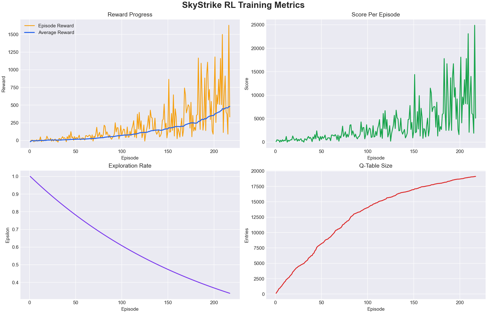

# SkyStrike Game: Implement Reinforcement Learning in a Classic Game with raylib-cs and C#

SkyStrike MVC is a simple arcade shooter written in C# with a lightweight MVC-style project structure.

The current implementation uses:
- .NET 10
- raylib-cs for rendering and input
- a modular `Model`, `View`, `Controller` layout for core game logic
- an embedded Q-learning trainer for RL experiments

This repository now supports three main workflows:
- play the game manually
- train an RL agent inside the game window
- run inference using a previously saved Q-table

## Current Features

### Gameplay
- Player movement with `A` / `D` or left and right arrow keys
- Shooting with `Space`
- Enemy spawning and movement
- Bullet-enemy and enemy-player collision detection
- Score, lives, and game-over UI
- Restart with `R`

### RL Features
- In-game Q-learning trainer
- Real-time training monitor overlay
- JSON persistence for the learned Q-table
- CSV export for episode metrics
- PNG plot generation from training metrics
- Inference mode that loads and applies the saved policy

## Project Structure

```text
Game C#/
├── GameCSharp/
│   ├── Controller/
│   │   ├── GameEngine.cs
│   │   ├── GameStepResult.cs
│   │   └── InputController.cs
│   ├── Model/
│   │   ├── Bullet.cs
│   │   ├── Enemy.cs
│   │   ├── EnemyManager.cs
│   │   ├── Entity.cs
│   │   ├── GameState.cs
│   │   ├── Physics.cs
│   │   └── Player.cs
│   ├── RL/
│   │   ├── PersistedQTable.cs
│   │   ├── RlAction.cs
│   │   ├── RlArtifacts.cs
│   │   ├── RlState.cs
│   │   ├── RlTrainer.cs
│   │   └── TrainingMonitorSnapshot.cs
│   ├── View/
│   │   ├── GameRenderer.cs
│   │   └── UIScreen.cs
│   ├── GameCSharp.csproj
│   └── Program.cs
├── artifacts/
│   └── rl/
│       ├── episode_metrics.csv
│       ├── episode_metrics_plot.png
│       └── qtable.json
├── scripts/
│   ├── plot-rl-metrics.py
│   ├── run-inference.ps1
│   └── run-inference.sh
├── PRD_SkyStrike_MVC.md
└── README.md
```

## Requirements

- Windows
- .NET 10 SDK
- Python virtual environment in `.venv` if you want plotting support

The project has already been set up in this workspace with:
- `Raylib-cs`
- `matplotlib` inside `.venv`

## Build And Run

### PowerShell

If `dotnet` is available on your `PATH`:

```powershell
dotnet build .\GameCSharp\GameCSharp.csproj
dotnet run --project .\GameCSharp\GameCSharp.csproj
```

If the current terminal does not see `dotnet`, use the full executable path:

```powershell
& "C:\Program Files\dotnet\dotnet.exe" build .\GameCSharp\GameCSharp.csproj
& "C:\Program Files\dotnet\dotnet.exe" run --project .\GameCSharp\GameCSharp.csproj
```

### Git Bash

```bash
"/c/Program Files/dotnet/dotnet.exe" run --project ./GameCSharp/GameCSharp.csproj
```

## Controls

### Manual Play
- Move left: `A` or `Left Arrow`
- Move right: `D` or `Right Arrow`
- Shoot: `Space`
- Restart after game over: `R`

### RL Training
- Toggle training on or off: `T`
- Increase training speed: `]`, `=`, or numpad `+`
- Decrease training speed: `[`, `-`, or numpad `-`

### RL Inference
- Launch with `--inference`
- In this mode, the loaded policy controls the ship automatically

## RL Workflow

### 1. Train The Agent

Run the game normally:

```powershell
& "C:\Program Files\dotnet\dotnet.exe" run --project .\GameCSharp\GameCSharp.csproj
```

Then press `T` in the game window to enable training.

While training is active, the monitor shows:
- whether a policy is loaded
- current episode reward
- last episode reward
- average reward
- best reward
- epsilon
- simulation steps per frame
- training steps per second
- Q-table entry count
- total training steps
- recent reward chart

### 2. Saved Artifacts

RL artifacts are stored in `artifacts/rl/`.

Files:
- `qtable.json`: learned Q-table and trainer metadata
- `episode_metrics.csv`: episode-by-episode training metrics
- `episode_metrics_plot.png`: generated chart from the CSV

### 3. Run Inference

Inference uses the saved `qtable.json` and disables learning.

#### PowerShell

```powershell
powershell -ExecutionPolicy Bypass -File .\scripts\run-inference.ps1
```

#### Git Bash

```bash
./scripts/run-inference.sh
```

If no saved model exists yet, the script exits with a clear message.

## Plotting RL Metrics

Generate or regenerate the saved training plot from the CSV:

```powershell
& ".\.venv\Scripts\python.exe" .\scripts\plot-rl-metrics.py
```

This writes the output to:
- `artifacts/rl/episode_metrics_plot.png`

The plot contains:
- reward per episode
- average reward
- score per episode
- epsilon decay
- Q-table growth

Current generated plot:



## RL Components

This project uses a simple tabular Q-learning setup embedded directly inside the game loop.

### 1. RL Trainer

File:
- `GameCSharp/RL/RlTrainer.cs`

Responsibility:
- runs the training loop
- chooses actions with epsilon-greedy exploration
- computes reward per step
- updates the Q-table
- saves learned data to disk
- exports episode metrics to CSV
- supports inference mode using a saved policy

Training mode:
- active when you press `T`
- runs multiple simulation steps per rendered frame
- explores with epsilon-greedy policy

Inference mode:
- active when the game is launched with `--inference`
- loads the saved Q-table
- always picks the best known action
- does not continue learning

### 2. State Representation

File:
- `GameCSharp/RL/RlState.cs`

The agent does not read raw pixels. Instead, the game is converted into a compact state tuple:
- `PlayerLane`: which horizontal lane the player is in
- `EnemyLane`: which lane the nearest enemy is in
- `EnemyDepth`: how far down the screen the nearest enemy is
- `EnemyCount`: how many enemies are active, bucketed
- `HasBullet`: whether the player already has a bullet on screen
- `CanShoot`: whether the weapon cooldown has finished
- `DangerLane`: lane of a dangerous nearby enemy, if any
- `HealthBucket`: remaining player health bucket

This state abstraction keeps the Q-table small enough to train directly in C# without a neural network.

### 3. Action Space

File:
- `GameCSharp/RL/RlAction.cs`

Available actions:
- `Idle`
- `MoveLeft`
- `MoveRight`
- `Shoot`
- `MoveLeftShoot`
- `MoveRightShoot`

These actions are sent into `InputController`, which makes the agent use the same control path as a human player.

### 4. Reward Function

Implemented in:
- `GameCSharp/RL/RlTrainer.cs`

Reward shaping is based on several signals:
- positive reward for destroying enemies
- negative reward for taking damage
- negative reward for game over
- small shooting penalty to reduce useless spam
- small idle penalty when enemies exist
- small alignment reward when movement gets closer to enemies horizontally
- tiny survival reward each step

This means the agent is encouraged to:
- survive longer
- line up with targets
- shoot effectively
- avoid unnecessary damage

### 5. Q-Table

Stored in memory as:
- `Dictionary<(RlState State, RlAction Action), float>`

Meaning:
- key: state and action pair
- value: estimated long-term value of taking that action in that state

Learning update:
- the trainer applies the standard Q-learning update rule
- learning rate and discount factor are defined in `RlTrainer.cs`

Because this is tabular Q-learning, there is no neural network, no replay buffer, and no gradient training.

### 6. Episode Metrics

Files:
- `GameCSharp/RL/RlArtifacts.cs`
- `artifacts/rl/episode_metrics.csv`

At the end of each episode, the trainer stores:
- episode number
- total reward
- score
- episode steps
- average reward
- best reward
- epsilon
- total training steps
- Q-table size

This makes it easy to inspect learning progress outside the game.

### 7. Persistence

Files:
- `GameCSharp/RL/RlArtifacts.cs`
- `GameCSharp/RL/PersistedQTable.cs`
- `artifacts/rl/qtable.json`

What is saved:
- all Q-table entries
- total training steps
- total completed episodes
- current exploration rate
- best and last reward values
- recent reward history

When it is saved:
- at episode completion
- when training is turned off
- when the game exits normally

This allows training to continue across sessions instead of starting from zero every time.

### 8. Monitor Overlay

Files:
- `GameCSharp/RL/TrainingMonitorSnapshot.cs`
- `GameCSharp/View/UIScreen.cs`

The monitor displays real-time RL information in the game window:
- whether training or inference is active
- whether a saved policy is loaded
- current reward
- last reward
- average reward
- best reward
- epsilon
- simulation speed
- training steps per second
- Q-table size
- total training steps
- reward history chart

### 9. Inference Scripts

Files:
- `scripts/run-inference.ps1`
- `scripts/run-inference.sh`

Purpose:
- start the game directly in inference mode
- check that `qtable.json` already exists
- prevent launching a fake inference session with no learned policy

## Balancing Notes

## Balancing Notes

The current gameplay has already been rebalanced to be easier to play and easier to learn:
- player speed was increased
- shooting cooldown was reduced
- enemy count was capped
- enemy spawn delay was increased
- enemy movement was slowed down

This means the RL agent now has a more learnable environment and manual play is less punishing.

## Architecture Notes

### Model
Contains the game state and gameplay rules.

Important files:
- `GameState.cs`
- `Player.cs`
- `EnemyManager.cs`
- `Physics.cs`

### Controller
Handles input and frame updates.

Important files:
- `InputController.cs`
- `GameEngine.cs`
- `GameStepResult.cs`

### View
Draws the game and monitor using raylib-cs.

Important files:
- `GameRenderer.cs`
- `UIScreen.cs`

### RL
Encodes actions, state abstraction, persistence, metrics, and training logic.

Important files:
- `RlTrainer.cs`
- `RlState.cs`
- `RlAction.cs`
- `RlArtifacts.cs`
- `PersistedQTable.cs`

## Known Behavior

- Existing terminals may not immediately detect `dotnet` after installation. Open a new terminal or use the full path to `dotnet.exe`.
- Inference mode depends on `artifacts/rl/qtable.json` being present.
- The current RL system uses tabular Q-learning, not a neural network model.
- Training quality depends heavily on reward shaping and current gameplay balance.

